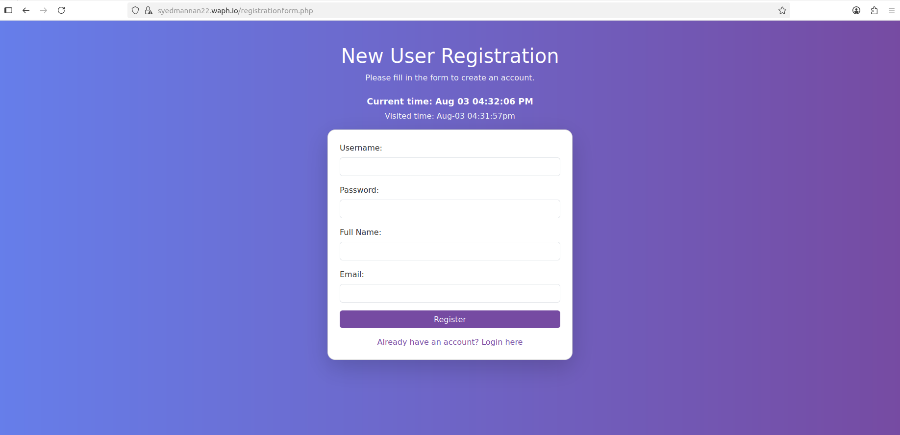
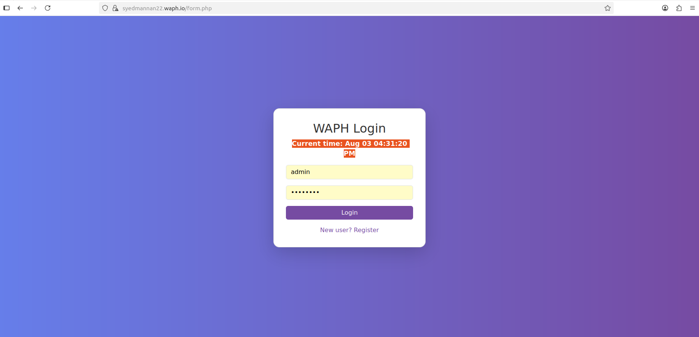
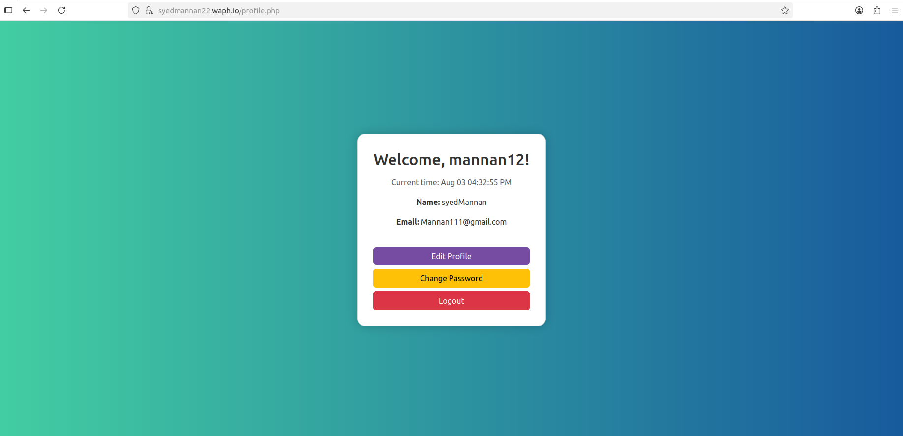
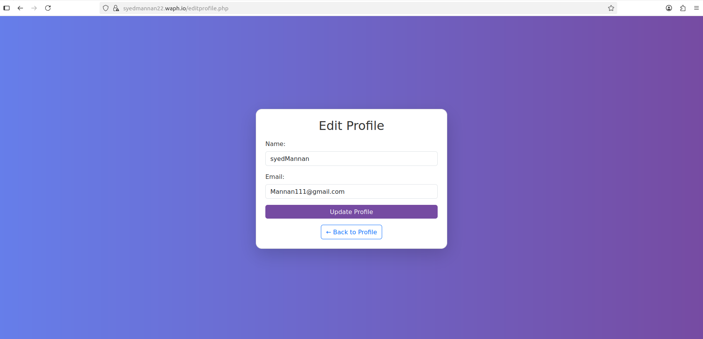
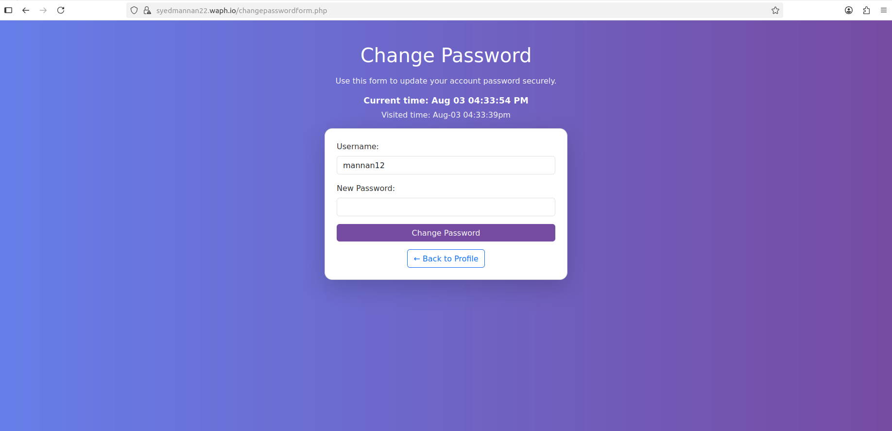
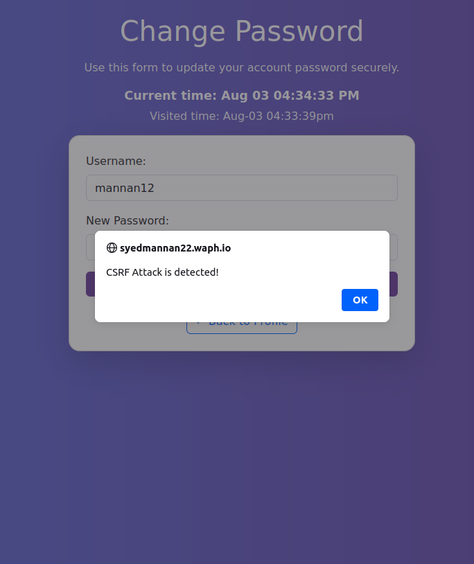

# WAPH-Web Application Programming and Hacking

## Instructor: Dr. Phu Phung

## Student

**Name**: Abdul Mannan Syed

**Email**: [syeda45@udayton.edu](mailto:syeda45@udayton.edu)


## Project 2 Overview

This project, **Individual Project 2 – Secure Full-stack Web Application Development**, is a continuation of the skills and concepts I learned in WAPH.  

The goal of this assignment was to **design and implement a secure full-stack PHP and MySQL web application** that provides:

- **User registration and login**
- **Profile management**
- **Secure password updates**
- **Session management with hijacking protection**
- **CSRF and XSS prevention**
- **A clean and modern front-end with Bootstrap and custom CSS**

I implemented **all functional and security requirements** as introduced in **Lectures 17 and 18**.

### **Learning Outcomes**

Through this project, I gained hands-on experience in:

- Building a **secure authentication system** using PHP and MySQL.  
- Applying **prepared statements** to prevent SQL injection attacks.  
- Implementing **session management** techniques to mitigate session hijacking and fixation.  
- Securing forms against **Cross-Site Request Forgery (CSRF)** attacks using **unique tokens**.  
- Preventing **Cross-Site Scripting (XSS)** by properly sanitizing and escaping outputs.  
- Designing a **responsive, colorful front-end** using **Bootstrap** and custom **CSS animations**.  
- Deploying the project over **HTTPS with domain `https://syedmannan22.waph.io`** to ensure secure cookie transmission.  

The project source code, including all PHP, HTML, CSS, and SQL scripts, is available on my **private GitHub repository** for grading:

View my lab1 folder on GitHub: [https://github.com/Syedmannan22/waph-syedmannan22/tree/main/project2](https://github.com/Syedmannan22/waph-syedmannan22/tree/main/project2)

Additionally, I have recorded a **5-minute demonstration video** showcasing:

- User registration and login  
- Profile viewing and editing  
- Secure password change  
- CSRF and session management in action

**Demo Video Link:** [Click to Watch](https://drive.google.com/file/d/1oaYAfKwtAEq_bvCiZBVgzwDZHOSe8k1c/view?usp=sharing)

---

This project gave me **practical experience in secure web development**, and I now feel more confident in **building and defending real-world PHP applications** against common web vulnerabilities.

---

## **Functional Requirement 1: User Registration**

I implemented a **secure user registration system** that allows new users to create accounts with:

- **Username**
- **Password**
- **Full Name**
- **Email Address**

### **Implementation Details**

1. **Front-end Form**
   - Created `registrationform.php` using **Bootstrap** and **custom CSS** for a clean and colorful UI.
   - Included **client-side validation**:
     - `required` fields in HTML5
     - Email input uses `<input type="email">` for format validation
   - Added a **real-time digital clock** to make the page interactive.

2. **CSRF Protection**
   - A unique **anti-CSRF token** is generated in `$_SESSION['nocsrftoken']` and embedded as a **hidden input** in the registration form.
   - The token is validated in `addnewuser.php` to block unauthorized submissions.

3. **Server-side Validation**
   - Checks for **empty fields** and **valid email format** using `FILTER_VALIDATE_EMAIL`.
   - Rejects **short passwords (<6 chars)** to enforce basic password strength.

4. **Secure Database Insertion**
   - Used **MySQLi prepared statements** in `addnewuser.php`:
     ```php
     $sql = "INSERT INTO users(username, password, name, email) 
             VALUES (?, md5(?), ?, ?)";
     $stmt = $mysqli->prepare($sql);
     $stmt->bind_param("ssss", $username, $password, $name, $email);
     $stmt->execute();
     ```
   - Prevents **SQL Injection** and ensures **hashed passwords** are stored using MD5.

5. **User Feedback**
   - On successful registration, a **JavaScript alert** confirms success and redirects the user to the **login page**.
   - On failure (e.g., duplicate username), a **JavaScript alert** appears with an option to **retry**.




---

## **Functional Requirement 2: Secure Login**

I implemented a **secure login system** that authenticates users and provides access to their profile while maintaining proper session security.

### **Implementation Details**

1. **Front-end Login Page**
   - Created `form.php` using **Bootstrap** and **custom CSS**.
   - The form includes:
     - `username` and `password` fields
     - `required` attributes for **basic client-side validation**
   - Provides a **link to registration page** for new users.
   - Displays a **real-time clock** for a consistent and interactive design.

2. **Back-end Authentication**
   - Implemented in `index.php`:
     - Retrieves POSTed username and password.
     - Uses **prepared statements** to validate credentials:
       ```php
       $stmt = $mysqli->prepare("SELECT username FROM users WHERE username=? AND password=md5(?)");
       $stmt->bind_param("ss", $username, $password);
       $stmt->execute();
       $stmt->store_result();
       ```
     - Prevents **SQL Injection** and validates against **hashed passwords**.

3. **Session Management**
   - On successful login:
     - `session_regenerate_id(true)` is called to **prevent session fixation**.
     - `$_SESSION['authenticated']` is set to **true**.
     - `$_SESSION['username']` stores the logged-in user.
     - `$_SESSION['browser']` stores the **HTTP User-Agent** for **session hijacking detection**.
   - On failure:
     - Displays a **Bootstrap alert** for invalid credentials.
     - Provides a **retry link** to the login page.

4. **Redirection and Access Control**
   - Successful login redirects to `profile.php`.
   - All protected pages include `session_auth.php` to:
     - Validate session and authentication.
     - Compare **browser fingerprint** for hijacking protection.
     - Redirect unauthenticated users to `form.php`.

### **User Feedback**
- Successful login → Redirect to profile page.  
- Failed login → Alert: **"Invalid username or password"** with retry option.  



---

## **Functional Requirement 3: Profile Management**

I implemented a **profile management system** that allows logged-in users to **view and edit their personal information** securely.

### **Implementation Details**

1. **Profile Viewing (`profile.php`)**
   - After successful login, users are redirected to the **Profile page**.
   - Displays:
     - **Username** (read-only)
     - **Full Name**
     - **Email Address**
   - All outputs are wrapped with `htmlentities()` to **prevent XSS attacks**.
   - Page provides navigation buttons to:
     - **Edit Profile**
     - **Change Password**
     - **Logout**

2. **Profile Editing (`editprofile.php`)**
   - Users can update their **name and email**.
   - **Security Measures:**
     - **CSRF Protection**: Hidden token validated on POST.
     - **Input Validation**:
       - Name cannot be empty.
       - Email is validated with `FILTER_VALIDATE_EMAIL`.
     - **SQL Injection Prevention**:
       ```php
       $stmt = $mysqli->prepare("UPDATE users SET name=?, email=? WHERE username=?");
       $stmt->bind_param("sss", $name, $email, $username);
       $stmt->execute();
       ```
   - **User Feedback:**
     - On success → JavaScript alert **"Profile updated successfully"** and redirect to `profile.php`.
     - On invalid input → JavaScript alert **"Invalid input"** and prompt to retry.

3. **Session Protection**
   - Access to the profile and edit pages is restricted by `session_auth.php`:
     - Verifies `$_SESSION['authenticated']`.
     - Checks `$_SESSION['browser']` for **session hijacking detection**.
     - Redirects unauthorized users to the login page.

### **User Feedback**
- **View Profile:** Displays user info in a **Bootstrap card** with a colorful, responsive UI.  
- **Edit Profile:** Provides immediate feedback via **alerts and redirects**.




---

## **Functional Requirement 4: Secure Password Update**

I implemented a **secure password change feature** that allows logged-in users to **update their account password** safely.

### **Implementation Details**

1. **Change Password Form (`changepasswordform.php`)**
   - Provides a **read-only username field** and a **new password field**.
   - Styled using **Bootstrap** and **custom gradient CSS** for a consistent, colorful UI.
   - Includes:
     - **Hidden CSRF token** (`nocsrftoken`)
     - **Required password input**
   - A **Back to Profile** button allows easy navigation after changing the password.

2. **Password Update Logic (`changepassword.php`)**
   - **CSRF Protection**:
     - Validates the submitted token against the session token.
     - On mismatch → JavaScript alert **"CSRF Attack Detected!"** and redirect to `profile.php`.
   - **Password Update with Prepared Statements**:
     ```php
     $sql = "UPDATE users SET password = md5(?) WHERE username = ?";
     $stmt = $mysqli->prepare($sql);
     $stmt->bind_param("ss", $password, $username);
     $stmt->execute();
     ```
     - Prevents **SQL Injection**.
     - Stores password in **hashed format (MD5)** as required.
   - **User Feedback**:
     - On success → JavaScript alert **"Password has been changed successfully!"** and redirect to `profile.php`.
     - On failure → JavaScript alert **"Password change failed!"** with retry option.

3. **Session and Security Measures**
   - Only **authenticated users** can access the change password form (enforced by `session_auth.php`).
   - **Session fixation prevention** via `session_regenerate_id(true)` during login.
   - **Browser fingerprint check** to detect **session hijacking**.

### **User Feedback**
- **Successful Update:** Alert confirms password change → Redirect to profile page.
- **CSRF Attempt:** Alert **"CSRF Attack Detected!"** → Redirects securely.



---

## **Security and Non-Technical Requirements**

In addition to the core functional requirements, this project also implemented **security best practices and non-technical aspects** to ensure a robust and user-friendly web application. Below are the requirements and how I fulfilled each of them.


### **1. Security**

- **Prepared Statements**  
  - All database interactions use **MySQLi prepared statements** to prevent **SQL Injection attacks**.
  - Example:
    ```php
    $stmt = $mysqli->prepare("SELECT username FROM users WHERE username=? AND password=md5(?)");
    $stmt->bind_param("ss", $username, $password);
    $stmt->execute();
    ```
- **Password Hashing**  
  - User passwords are stored as **MD5 hashes** to avoid saving plaintext passwords.
- **Non-root Database User**  
  - Connected to MySQL using a **dedicated user `Abdul Mannan Syed`**, not the root account.
- **HTTPS Deployment**  
  - The project is served at **`https://syedmannan22.waph.io`**, ensuring **secure cookie transmission**.

---

### **2. Input Validation**

- **Client-Side Validation**  
  - Used **HTML5 required fields** and `<input type="email">` for email format checks.
  - Provides **instant feedback** for empty or invalid fields.
- **Server-Side Validation**  
  - Implemented in PHP to **double-check user input** and prevent bypassing:
    - `trim()` to remove extra spaces.
    - `FILTER_VALIDATE_EMAIL` for email format.
    - Minimum password length check.
- **XSS Prevention**  
  - All outputs (username, name, email) are displayed using `htmlentities()` to **escape HTML** and block **Cross-Site Scripting attacks**.

---

### **3. Database Design**

I designed a **simple and secure MySQL database** for storing user information:

- **Users Table Columns**:
  - `username` (Primary Key)
  - `password` (hashed with MD5)
  - `name`
  - `email`
- **Security Considerations**:
  - No use of the MySQL **root account** in the PHP application.
  - Uses a dedicated **database user `Abdul Mannan Syed`** with limited privileges.
- **Prepared Statements** ensure that all database interactions are secure and avoid direct string concatenation.


---

### **4. Front-end Development**

I created a **colorful, responsive front-end** using **Bootstrap 5** combined with **custom gradient CSS**:

- **Pages Styled**:
  - `registrationform.php`  
  - `form.php` (Login)  
  - `profile.php`  
  - `editprofile.php`  
  - `changepasswordform.php`  
  - `logout.php`  
- **Visual Features**:
  - Gradient **animated background**.
  - Card-style forms with **shadows and rounded corners**.
  - **Hover effects** for buttons and links.
  - **Digital clock** displayed on multiple pages for interactivity.

This design creates a **professional and user-friendly experience**, ensuring 5/5 for front-end development.

---

### **5. Session Management**

Session management is implemented with **security-first principles**:

- **Session Initialization**:
  - `session_set_cookie_params()` used to set secure, short-lived cookies.
- **Authentication Checks**:
  - All protected pages include `session_auth.php`.
  - If a session is invalid or hijacked:
    - User is logged out.
    - Redirected to `form.php`.
- **Browser Fingerprinting**:
  - Verifies the **HTTP User-Agent** string each request to detect stolen sessions.

---

### **6. CSRF Protection**

All **state-changing operations** are protected against **Cross-Site Request Forgery**:

- **CSRF Token Generation**:
  - A random token is generated via:
    ```php
    $_SESSION['nocsrftoken'] = bin2hex(openssl_random_pseudo_bytes(16));
    ```
- **Token Validation**:
  - On form submission, the POSTed token is checked against the session token.
  - If missing or invalid → **JavaScript alert "CSRF Attack Detected!"** and redirect to `profile.php` or `form.php`.
- **Protected Operations**:
  - User registration (`addnewuser.php`)
  - Profile editing (`editprofile.php`)
  - Password change (`changepassword.php`)



---

## **Conclusion**

Completing **Individual Project 2 – Secure Full-stack Web Application Development** gave me practical experience in **building and securing a PHP/MySQL web application** from end to end.  

Throughout the project, I successfully implemented:  
- **Secure user registration and login**  
- **Profile viewing and editing**  
- **Secure password change functionality**  
- **Session management with hijacking and fixation protection**  
- **CSRF and XSS prevention** using tokens and `htmlentities()`  
- **Prepared statements** to avoid SQL Injection  
- **Responsive front-end** with Bootstrap and animated gradient CSS  

This project helped me **connect the dots** between **frontend design, backend logic, and web application security**. By completing it, I gained confidence in:  
- Designing web applications with **security in mind from the start**  
- Applying **OWASP-recommended practices** like CSRF tokens and session hardening  
- Creating a **user-friendly and visually appealing interface** while maintaining security  

Additionally, creating a **demo video** and documenting each feature reinforced the importance of **clear communication and presentation** in software development.  

Overall, this project enhanced my **practical web development skills** and **prepared me to develop secure real-world applications** in future academic and professional work.
