# WAPH-Web Application Programming and Hacking

## Instructor: Dr. Phu Phung

## Student

**Name**: Abdul Mannan Syed

**Email**: [syeda45@udayton.edu](mailto:syeda45@udayton.edu)


## Lab 2 Overview

This lab builds upon the web foundations introduced in Lecture 4 and 5. It is divided into two main parts.

In **Task 1**, I explored the fundamentals of front-end web development concepts using HTML, CSS, and JavaScript. The objective was to build a web page that demonstrates interaction with forms, inline and external JavaScript, and dynamic updates such as real-time clocks.

In **Task 2**, I learned how to dweb page by integrating dynamic front-end features using Ajax, CSS, jQuery, and Web APIs. This task helped me better understand asynchronous web interactions, JavaScript libraries, and how client-side scripts can communicate with both local and external servers.

This lab deepened my understanding of both client-server web communication and basic web application programming.

View my lab1 folder on GitHub: [https://github.com/saketh-nandan-reddy/waph-saketh/tree/main/labs/lab2](https://github.com/saketh-nandan-reddy/waph-saketh/tree/main/labs/lab2)

## Task 1: Basic HTML with forms, and JavaScript

####  a. HTML 
I created a file named waph-karlas2.html and added basic HTML structure including:
- My name and course information
- An image of my headshot (150px)
- Two forms to demonstrate HTTP GET and POST methods

`waph-saketh.html`

```HTML
<!DOCTYPE html>
<html>
<head>
  <meta charset="utf-8">
  <meta name="viewport" content="width=device-width, initial-scale=1">
  <title>WAPH-mannan22</title>
</head>
<body>
<div id="top">
  <h1>Web Application PRogramming and Hacking</h1>
  <h2>Front-end Web Development Lab</h2>
  <h3>Instructor: Dr. Phu Phung</h3>
</div>
<div id="memubar">
  <h3>Student: Abdul Mannan Syed</h3>
</div>
<div id="main">
  <p>A simple HTML page</p>
  Using the <a href="https://www.w3schools.com/html" target="_blank">W3Schools template</a>
  <hr> <b>Interaction with forms</b>
  <div>
    <i>Form with HTTP GET Request</i>
    <form action="/echo.php" method="GET">
      Your input: <input name="data">
      <input type="submit" value="submit">
    </form>
  </div>
  <div>
    <i>Form with HTTP POST Request</i>
    <form action="/echo.php" method="POST" name="echo_post">
      Your input: <input name="data" onkeypress="console.log('you have pressed a key')">
      <input type="submit" value="submit">
    </form>
  </div>
</div>
</body>
</html>
```

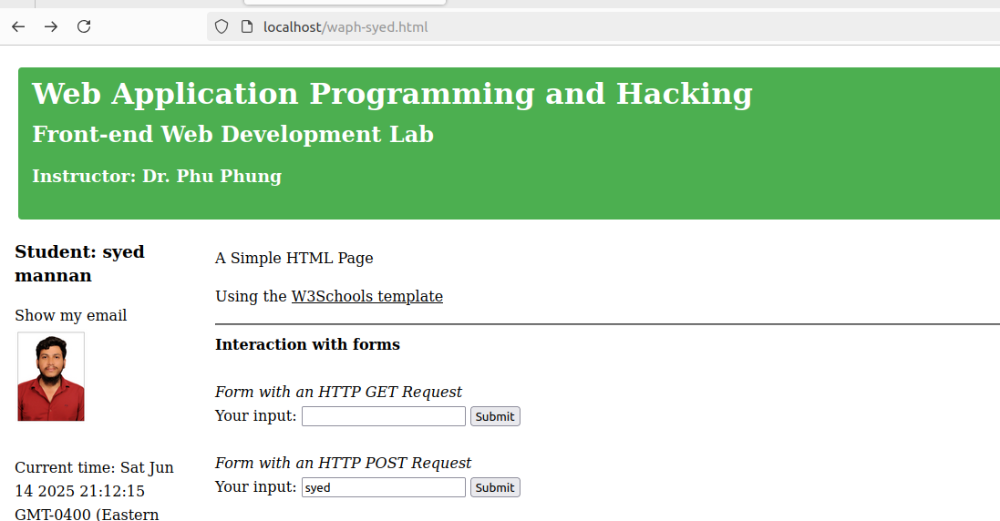  

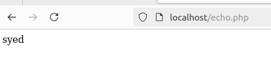  
  
####  b. Simple JavaScript

1. Inline JavaScript to show current date/time and log key press
  - Used an onclick event in a `<div>` to show the current date/time using Date().
  - Added an onkeypress event inside the POST form input field to log key presses to the browser console.

```HTML
  <div>
    <i>Form with HTTP POST Request</i>
    <form action="/echo.php" method="POST" name="echo_post">
      Your input: <input name="data" onkeypress="console.log('you have pressed a key')">
      <input type="submit" value="submit">
    </form>
  </div>
  <hr>
  <b>Experiments with JavaScript code</b><br>
  <i>Inlined JavaScript</i>
  <div id="date" onclick="document.getElementById('date').innerHTML=Date()">Click here to show Date()</div>
```
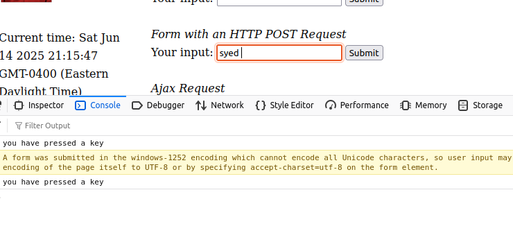  

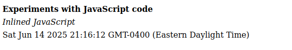  

2. JavaScript for digital clock in a `<script>` tag
  - Created a `<div> with id="digit-clock"`.
  - Used `setInterval()` to update the content every second.

```HTML
  <div id="digit-clock">
    <script>
      function displayTime(){
        document.getElementById('digit-clock').innerHTML = "Current time:" + new Date();
      }
      setInterval(displayTime, 1000);
    </script>
  </div>
```

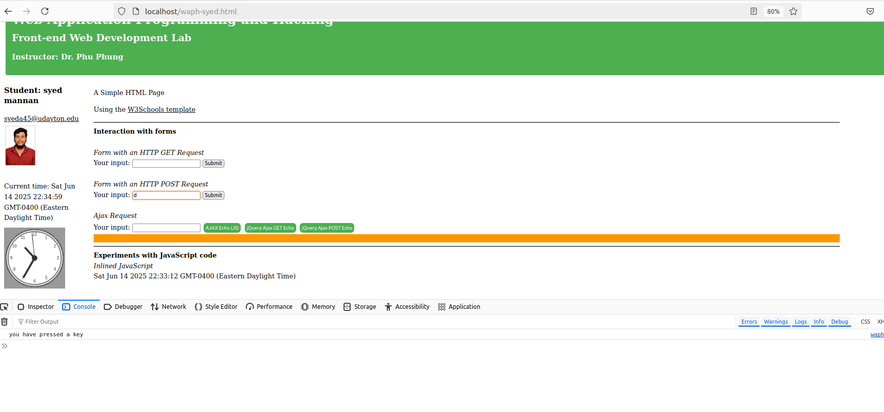  
**Figure 6. Internal JS script for digital clock output** 

3. JavaScript file to toggle email visibility
  - Created a separate email.js file.
  ```JS
    var shown = false;
    function showhideEmail(){
      if(shown){
        document.getElementById('email').innerHTML = "show my email";
        shown = false;
      }else{
        var myemail = "<a href='mailto:karlas2"+"@"+"udayton.edu'> karlas2"+"@"+"udayton.edu</a>";
        document.getElementById('email').innerHTML = myemail;
        shown = true;
      }
    }
  ```
  - The HTML page includes:
  ```HTML
  <div id="email" onclick="showhideEmail()">Show my email</div>
  <script src="email.js"></script>
  ```  

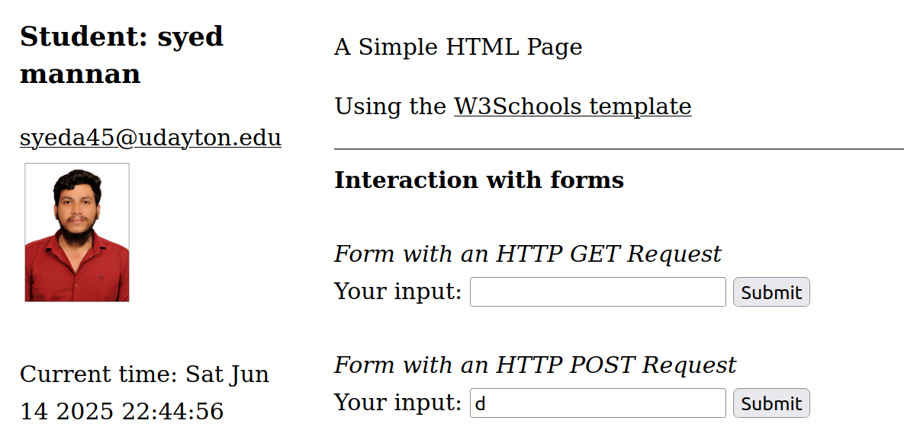  
**Figure 7. External JS for email**  

4. Analog clock using external script
Included the script from the lecture:
```HTML
<canvas id="analog-clock" width="150" height="150" style="background-color:#999"></canvas>
<script src="https://waph-phung.github.io/clock.js"></script>
<script>
  var canvas = document.getElementById("analog-clock");
  var ctx = canvas.getContext("2d");
  var radius = canvas.height/2;
  ctx.translate(radius,radius);
  radius = radius * 0.90;
  setInterval(drawClock, 1000);
  function drawClock(){
    drawFace(ctx, radius);
    drawNumbers(ctx, radius);
    drawTime(ctx, radius);
  }
</script>
```
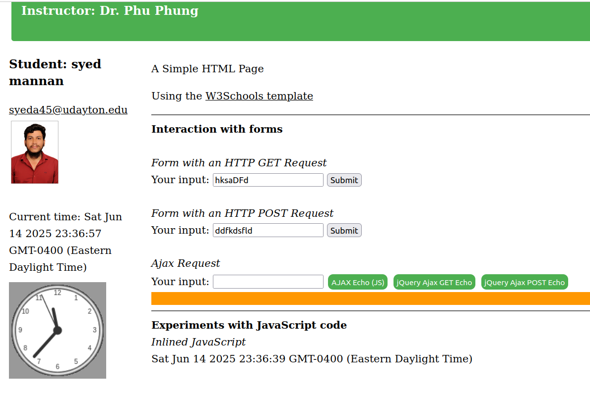  
**Figure 8. External JS to display anlog clock**  


### Task 2: Ajax, CSS, jQuery, and Web API integration

####  a. Ajax 

I added a user input field and a button that triggers the getEcho() function to send an Ajax GET request to echo.php. The response is then displayed in the #response div.

```HTML
<i>Ajax requests</i><br>
Your input: 
<input name="name" onkeypress="console.log('you have pressed a key')" id="data">
<input class="button round" type="button" value="Ajax Echo" onclick="getEcho()">
<div id="response"></div>
<script>
  function getEcho() {
    var input = document.getElementById("data").value;
    if (input.length == 0) return;
    var req = new XMLHttpRequest();
    req.onreadystatechange = function() {
      if (this.readyState == 4 && this.status == 200) {
        document.getElementById("response").innerHTML =
          "Response from server: " + this.responseText;
      }
    };
    req.open("GET", "echo.php?data=" + input, true);
    req.send();
    document.getElementById("data").value = "";
  }
</script>
```

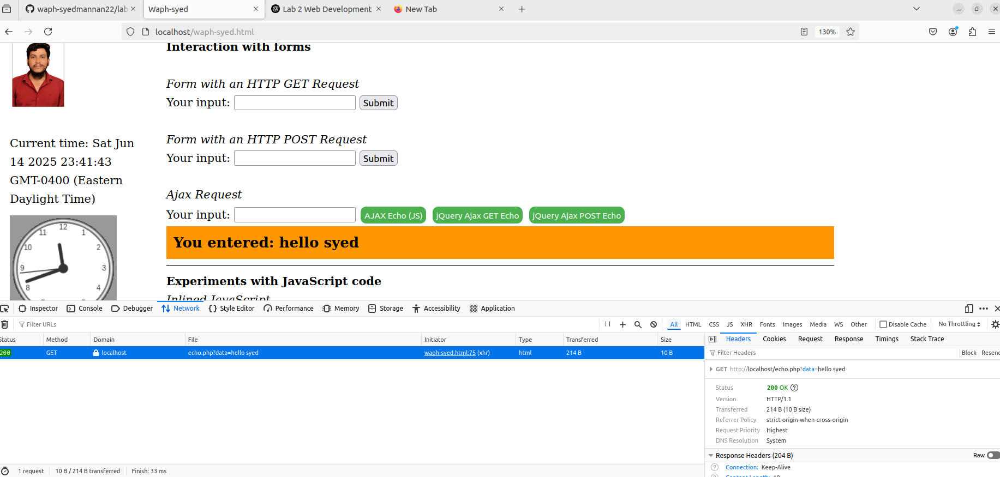  
**Figure 9. Displaying Ajax Get request**  

#### b. CSS 

I used three types of CSS in the project:

- Inline CSS: e.g., `style="background-color:#999"` in `<canvas>`
- Internal CSS: added inside a `<style>` tag for button styling
- External CSS: linked from a remote URL using link `rel="stylesheet"`

```HTML
#External CSS
<link rel="stylesheet" href=https://waph-phung.github.io/style1.css>
#Internal CSS
<style>
  .button {
    background-color: #4CAF50; /* Green */
    border: none;
    color: white;
    padding: 5px;
    text-align: center;
    text-decoration: none;
    display: inline-block;
    font-size: 12px;
    margin: 4px 2px;
    cursor: pointer;
  }
  .round {border-radius: 8px;}
  #response {background-color: #ff9800;} /* Orange */
</style>
#Inline CSS
<canvas id="analog-clock" width="150" height="150" style="background-color:#999"></canvas>
```

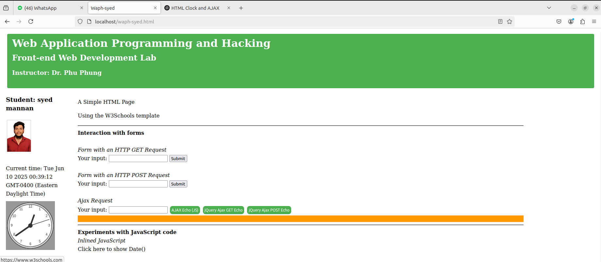  
**Figure 10. using css**  

####  c. jQuery

1. Ajax GET Request using jQuery

```HTML
<input class="button round" type="button" value="jQuery Ajax GET Echo" onclick="jQueryAjax ()">
<script>
  function jQueryAjax() {
    var input = $("#data").val();
    if (input.length == 0) return;
    $.get("echo.php?data="+input,
    function(result) {
      $("#response").html("Response from server:" + result);
    }
    );
    $("#data").val("");
  }
</script>
```

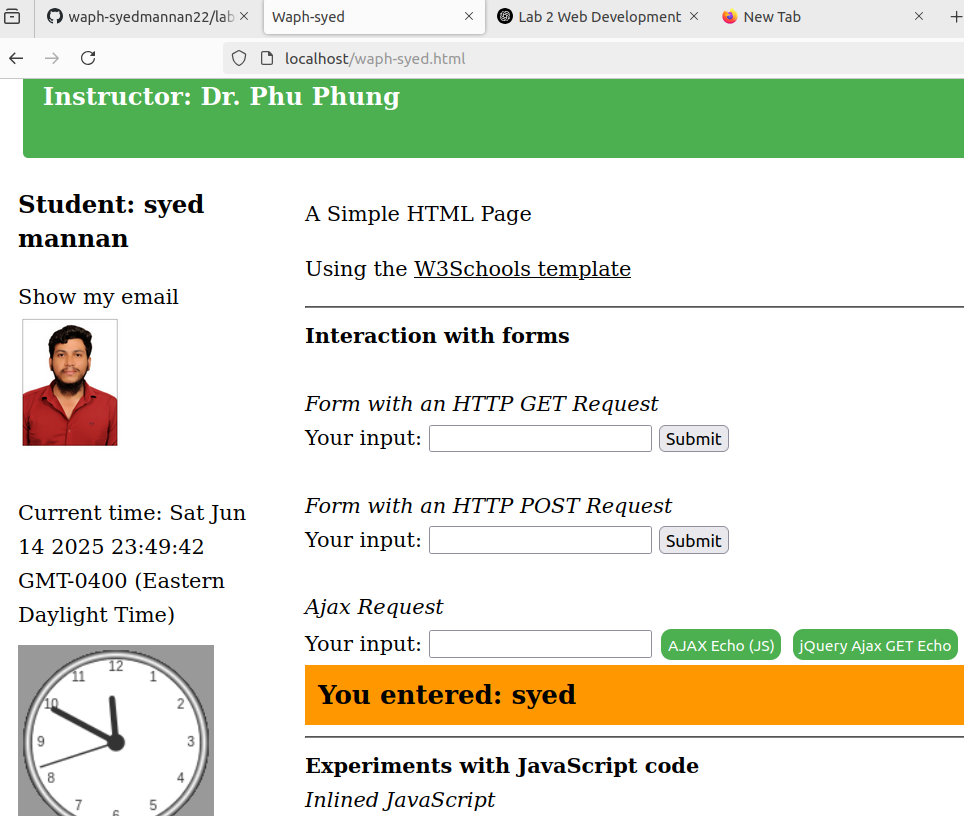  
**Figure 11. Jquery GET Request**

2. Ajax POST Request using jQuery

```HTML
<input class="button round" type="button" value="jQuery Ajax POST Echo" onclick="jQueryAjaxPost()">
<script>
  function jQueryAjaxPost() {
    var input = $("#data").val();
    if (input.length == 0) return;
    $.post("echo.php",{data: input},
    function( result ) {
      $("#response").html("Response from server:" + result);
    }
    );
    $("#data").val("");
  }
</script>
```

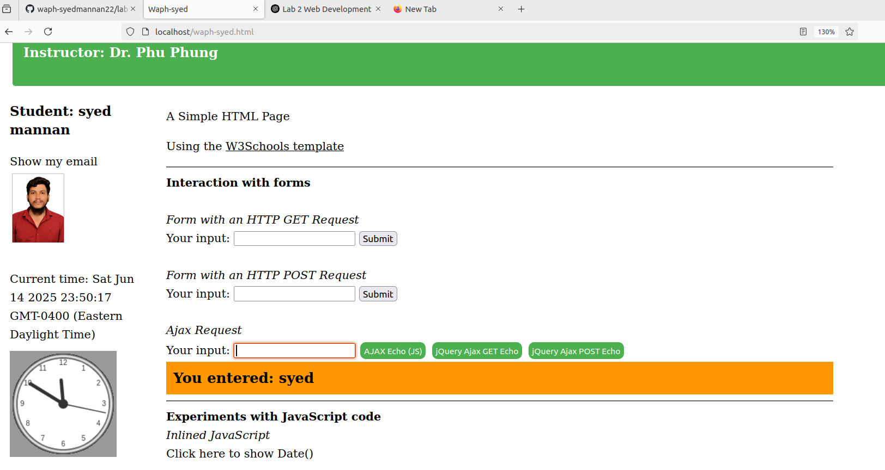  
**Figure 12. Jquery POST Request**

#### d. Web API integration

1. Joke API with jQuery 

Displays a programming joke from JokeAPI on page load:

```HTML
<div id="joke"></div>
<script>
  $.get("https://v2.jokeapi.dev/joke/Programming?type=single", function(result){
    console.log("From jokeAPI: "+ JSON.stringify(result));
    $("#joke").html("A Programming Joke of the day: " + result.joke);
  });
</script>
```

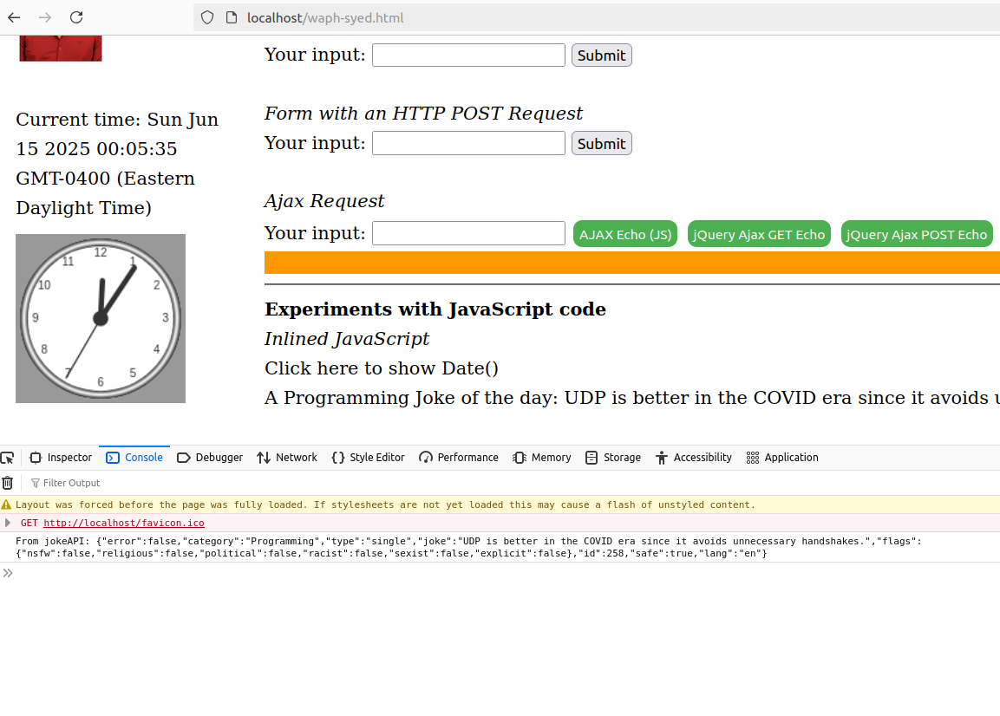  
**Figure 13. Displaying Joke**  

2. Agify API with jquery

Guessing age with input given 

```HTML
<input class="button round" type="button" value="guess Age" onclick="guessAge($('#data').val())">
<script>
  async function guessAge(name) {
    const response = await fetch("https://api.agify.io/?name="+name);
    const result = await response.json();
    $('#response').html("Hi "+ name + ", your age shouls be "+ result.age);
  }
</script>
```

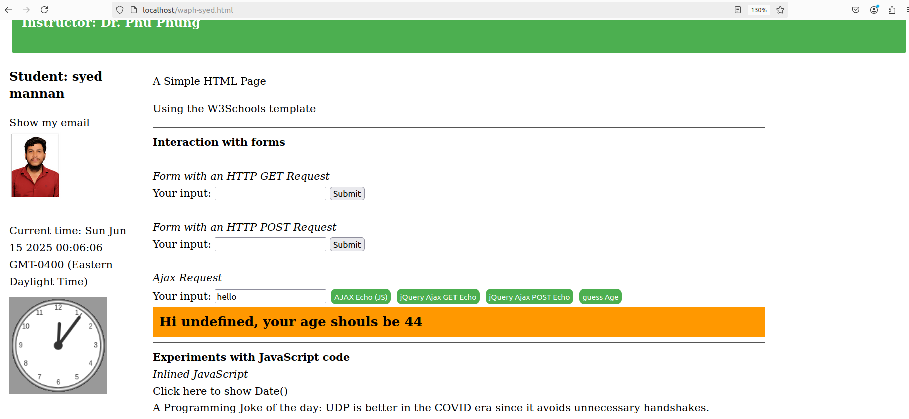  
**Figure 14. Guessing Age**  