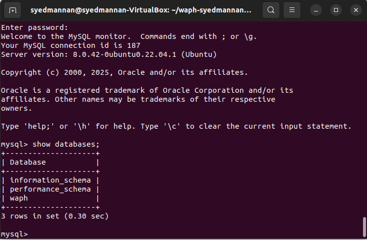
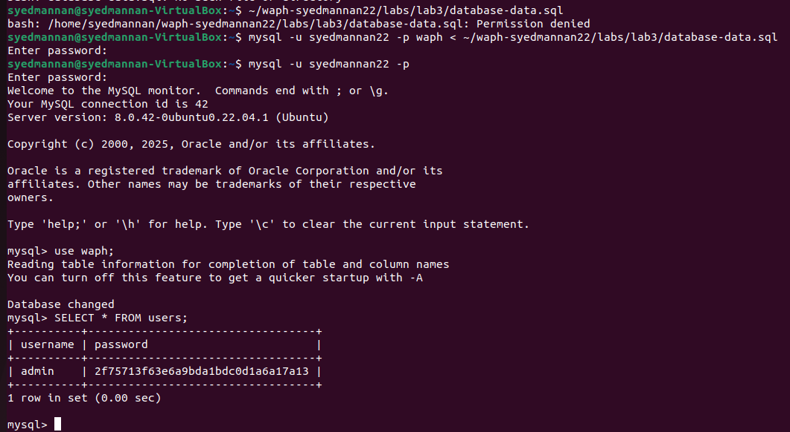
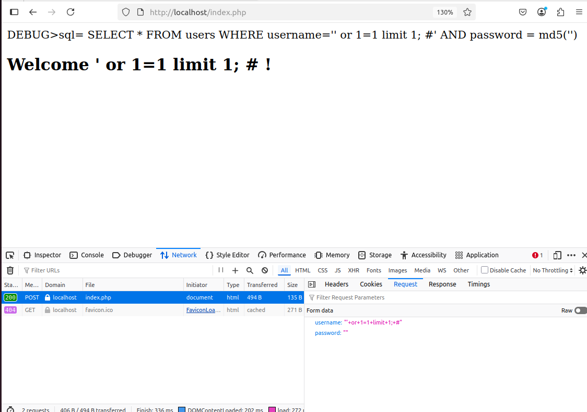
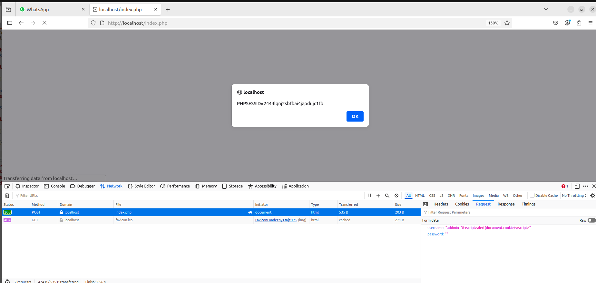
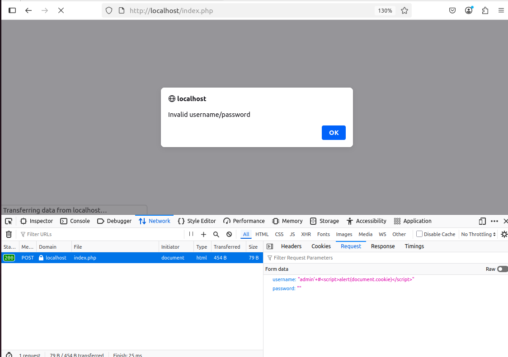
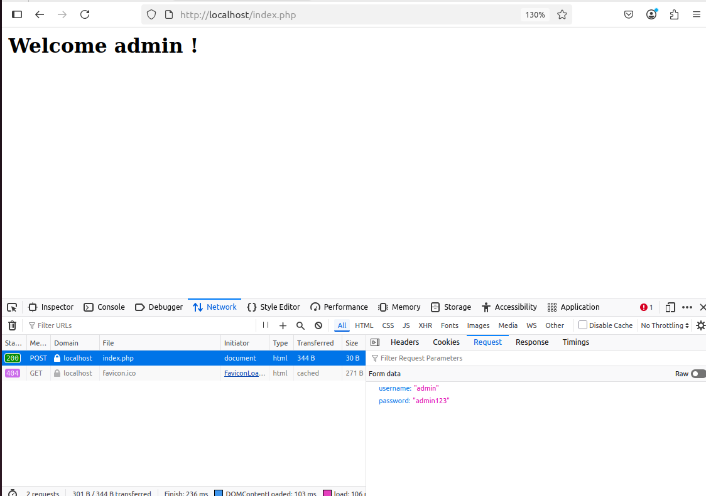

<<<<<<< HEAD
# waph-syedmannan22
=======
# WAPH-Web Application Programming and Hacking

## Instructor: Dr. Phu Phung

## Student

**Name**: Abdul Mannan Syed

**Email**: [syeda45@udayton.edu](mailto:syeda45@udayton.edu)


## Lab 3 Overview
In this lab, I explored the critical concepts and practices of building secure web applications using PHP and MySQL. The main goal was to understand how typical vulnerabilities—such as SQL Injection (SQLi) and Cross-Site Scripting (XSS) can be exploited in a login system, and how to defend against them using secure coding techniques.

The lab was divided into four main parts:

1. **Database Setup and Management**
I created a new MySQL database and user account, set up a users table, and inserted hashed password data securely.

2. **Basic (Insecure) Login System**
I developed a basic PHP login system that connects to the database, but initially used unsafe practices like string-concatenated SQL queries.

3. **Web Attacks: SQL Injection and XSS**
I performed hands-on attacks to demonstrate how attackers can exploit input fields to bypass authentication or inject malicious scripts.

4. **Security Hardening**
I refactored the login system to use prepared statements to prevent SQL injection and added output sanitization to mitigate XSS.

By going through each of these steps, I gained practical experience in identifying security flaws in a web application and implementing defense techniques recommended by OWASP.

View my lab1 folder on GitHub:[https://github.com/Syedmannan22/waph-syedmannan22/tree/main/labs/lab3](https://github.com/Syedmannan22/waph-syedmannan22/tree/main/labs/lab3)

## Task 1: Basic HTML with forms, and JavaScript

## Task a - Database Setup and Management
In this task, I set up the backend MySQL environment to support a simple login system. The process involved installing the MySQL server, creating a database and user, setting permissions, and inserting initial data into the users table.

**MySQL Installation and Connection**
I installed MySQL on my Ubuntu VM using the command:

```bash
sudo apt-get install mysql-server -y
```

To verify the installation, I checked the version with:

```bash
mysql -V
```

Then, I successfully connected to the MySQL server using:

```bash
sudo mysql -u root -p
```
Just pressing Enter since the default root password is empty.

  
**Figure 1. installations of mysql server**  

**Creating the Database, User, and Permissions**
I created a new database called waph and a dedicated MySQL user sed with the following commands saved in database-account.sql:

```sql
CREATE USER 'syedmannan22'@'localhost' IDENTIFIED BY 'Mannan@123';
GRANT ALL ON waph.* TO 'syedmannan22'@'localhost';
CREATE DATABASE waph;
```
These commands ensure that the web application doesn’t use the root account, aligning with best security practices.

**Creating the Users Table and Inserting Hashed Data**
I then created a users table and inserted an initial user with a hashed password. This was stored in database-data.sql:

```sql
DROP TABLE IF EXISTS users;
CREATE TABLE users (
    username VARCHAR(50) PRIMARY KEY,
    password VARCHAR(100) NOT NULL
);
INSERT INTO users (username, password) VALUES ('admin', MD5('admin123'));
```
The password is securely stored using MySQL’s MD5() hashing function, demonstrating one-way protection against plaintext password leaks.

  
**Figure 2. waph database with users table**  

## Task B – A Simple (Insecure) Login System with PHP/MySQL

In this task, I built a functional but intentionally insecure login system using PHP and MySQL. The goal was to demonstrate how user inputs can directly influence SQL queries and why this can be dangerous.

**Step 1 – MySQLi Driver Installation**
Before writing PHP code that interacts with MySQL, I installed the required PHP-MySQLi extension:

```bash
sudo apt-get install php-mysqli
sudo service apache2 restart
```
This ensured that PHP could communicate with MySQL using the improved MySQLi interface.

**Step 2 – Writing the Login Logic**
I implemented a login form in form.php, which collected the user's username and password and passed them via POST to the same file. The authentication was handled by the checklogin_mysql function.

Here’s a summary of the key code I wrote:

```php
$mysqli = new mysqli('localhost', 'syed' /*Database username*/, 'syedmannan22' /*Database password*/, 'Mannan@123' /*Database name*/);
if ($mysqli->connect_errno) {
    printf("Database connection failed: %s\n", $mysqli->connect_error);
    exit();
}

$sql = "SELECT * FROM users WHERE username='" . $username . "' ";
$sql = $sql . " AND password = md5('" . $password . "')";
echo "DEBUG>sql= $sql"; // return TRUE;
$result = $mysqli->query($sql);
if ($result->num_rows == 1) {
    return TRUE;
}
return FALSE;
```
This function builds an SQL string directly using the user’s input. Although it works and allows valid credentials to log in, it is highly vulnerable to SQL injection because it does not sanitize or validate inputs.

**Step 3 – Deployment and Testing**
I deployed the PHP files (form.php and index.php) to the web server directory /var/www/html, and verified that the login works correctly with the credentials stored in the database (admin / MyP4$$w0rd).

  
**Figure 3. successful login message**  

## Task C – Performing XSS and SQL Injection Attacks
This task involved identifying and exploiting two common vulnerabilities in web applications: SQL Injection (SQLi) and Cross-site Scripting (XSS). Using the intentionally insecure login system from Task B, I demonstrated how attackers can bypass authentication or inject malicious scripts using specially crafted inputs.

**SQL Injection Attack**
To exploit the SQL injection vulnerability, I entered the following input into the username field:

```
' or 1=1;#
```
The password field can be left blank or filled with any value. This payload manipulates the SQL query executed by the server:

```sql
SELECT * FROM users WHERE username='' OR 1=1;#' AND password = md5('')
```
The OR 1=1 clause always evaluates to true.

The # symbol comments out the rest of the SQL query, including the password check. The application logged in the attacker without requiring a valid username or password.

  
**Figure 4. successful login message using sql injection** 

This attack succeeded because the application directly concatenated user inputs into the SQL query without validation or sanitization. As a result, the attacker was able to alter the logic of the query to always return true, effectively bypassing authentication.

**Cross-site Scripting (XSS) Attack**
To test for XSS, I entered the following input into the username field:

```
admin' #<script>alert(document.cookie)</script>
```
 When the page loaded, a pop-up appeared showing the browser's cookies, confirming that the malicious JavaScript was executed.

   
**Figure 5. Alert box triggered by the XSS payload** 

This vulnerability occurred because the application rendered user input directly into the HTML response without escaping it. This allowed the attacker to inject and execute arbitrary JavaScript code in the context of the user’s browser.

## Task D – Prepared Statement Implementation and Security Analysis
This task involved improving the security of the login system by mitigating SQL injection and XSS vulnerabilities. I implemented prepared statements to prevent SQL injection and performed basic output sanitization to protect against XSS.

**Prepared Statement Implementation**
To address the SQL injection vulnerability demonstrated in Task C, I updated the checklogin_mysql function in index.php to use prepared statements with parameterized queries. Below is the updated code:

```php
function checklogin_mysql($username, $password) {
    $mysqli = new mysqli('localhost', 'syedmannan22', 'Mannan@123', 'waph');
    
    if ($mysqli->connect_errno) {
        printf("Database connection failed: %s\n", $mysqli->connect_error);
        exit();
    }

    $sql = "SELECT * FROM users WHERE username=? AND password = md5(?)";
    $stmt = $mysqli->prepare($sql);
    $stmt->bind_param("ss", $username, $password);
    $stmt->execute();
    $result = $stmt->get_result();
    if ($result->num_rows == 1) {
        return TRUE;
    }
    return FALSE;
}
```
After implementing the above code, I tested the same SQL injection payload from Task C (' or 1=1;#) and confirmed that it no longer bypasses authentication.

   
**Figure 6. XSS attack failed** 

   
**Figure 7.  successful login message** 

Prepared statements treat user inputs as data rather than code, which prevents attackers from altering the SQL logic. The placeholders (?) in the SQL statement are bound to actual values using bind_param, ensuring that malicious input cannot be executed as SQL code.

**Security Analysis**
1. Why Prepared Statements Prevent SQL Injection
Prepared statements separate the SQL logic from user input. This means that even if an attacker submits SQL commands as input, those inputs are treated as literal values and not executable code. As a result, the structure of the query remains fixed and secure, regardless of what the user enters.

2. Output Sanitization for XSS Prevention
To mitigate XSS, I updated the welcome message to sanitize user output using PHP's htmlspecialchars() function:

```php
 Welcome <?php echo htmlspecialchars($_POST['username']); ?> !</h2>
```
This ensures that special characters like < and > are properly escaped, preventing the browser from interpreting them as HTML or JavaScript.

3. Discussion: Remaining Programming Flaws and Vulnerabilities

**Empty Inputs:** The current system does not check if the username or password fields are empty. This should be validated before sending input to the database.

**Database Errors:** If the database connection fails or the query is malformed, the user only sees a generic failure or debug output. In production, meaningful error messages should be logged (not displayed) to avoid leaking system details.

**Case Sensitivity:** The system does a strict match on the username, which could be problematic if the application expects case-insensitive logins. Handling of case-sensitivity should be considered based on system requirements.

>>>>>>> 27b4e82 (Update README for Lab 3)
