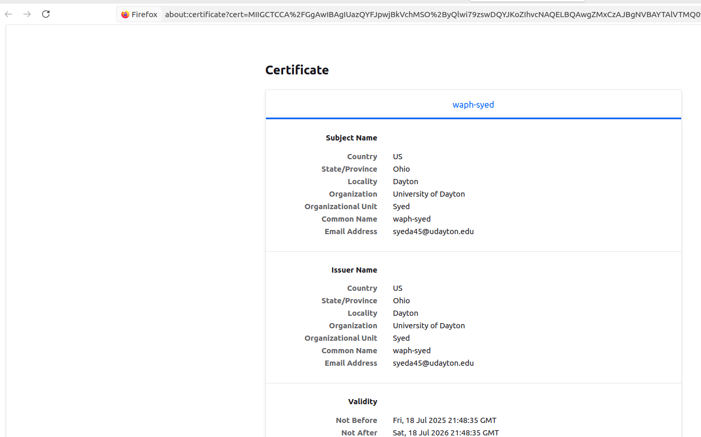

# WAPH-Web Application Programming and Hacking

## Instructor: Dr. Phu Phung

## Student

**Name**: Abdul Mannan Syed

**Email**: [syeda45@udayton.edu](mailto:syeda45@udayton.edu)


## Lab 4 Overview
This lab focused on understanding and securing session management in PHP web applications. Through a series of hands-on tasks, I explored how sessions are created and managed in PHP, how session data is exchanged between a client and server, and how vulnerabilities like session hijacking can compromise web application security.

I started by deploying a basic session test page and observing how different browsers maintain unique sessions. Using Wireshark, I monitored the session handshaking process and analyzed how session cookies are issued and used. I then simulated a session hijacking attack to understand how easily an attacker could exploit insecure session handling.

Building on this knowledge, I implemented a login system using PHP sessions, and tested how attackers could bypass authentication by stealing session IDs. In the final task, I applied defensive techniques to secure sessions—by enabling HTTPS, setting HttpOnly and Secure cookie flags, and verifying session integrity using browser fingerprints to detect hijacking attempts.

Overall, this lab helped me gain a deeper understanding of both the vulnerabilities and best practices associated with session-based authentication, reinforcing the importance of securing session data in real-world web applications.

View my lab4 folder on GitHub:[https://github.com/Syedmannan22/waph-syedmannan22/tree/main/labs/lab4](https://github.com/Syedmannan22/waph-syedmannan22/tree/main/labs/lab4)


## Task 1: Understanding Session Management in a PHP Web Application

#### 1.a. Deploy and test sessiontest.php

To complete this task, I deployed the sessiontest.php file to my Apache web server. I accessed it from two different browsers (Chrome and Firefox) to observe how PHP handles sessions independently for each browser. Each browser started with its own session, and the visit count increased separately as I refreshed the page.

This demonstrated how PHP uses cookies to maintain a unique session for each client, and how session data is stored on the server.

sessiontest.php
```php
<?php
session_start();
if(isset($_SESSION['views']))
    $_SESSION['views'] = $_SESSION['views']+ 1;
else{
    $_SESSION['views'] = 1;
}
echo "You have visited this page " . $_SESSION['views'] . " times"; 
?>
```


**Fig. Browsers showing different count**

#### 1.b. Observe the Session-Handshaking using Wireshark

For this task, I used Wireshark to observe how a PHP session is initiated and maintained between the client and server. I launched Wireshark with sudo wireshark to capture privileged network traffic, selected my active network interface (e.g., eth0, enp0s3, or any), and started the capture.

Before accessing sessiontest.php, I cleared the browser cookies to ensure there was no existing session. I then visited the page and recorded the first HTTP request/response, and then refreshed the page to capture the subsequent request/response.

This allowed me to see how PHP initially sets the Set-Cookie header with a new session ID and how the browser returns that session ID in future requests.

- On the first visit, the HTTP response includes a Set-Cookie: PHPSESSID=... header, which creates a new session for the user.
- On subsequent visits, the browser includes the session ID using the Cookie: PHPSESSID=... header in the request, enabling the server to retrieve the correct session data.


**Fig.  First HTTP Response showing the Set-Cookie: PHPSESSID=... header**


**Fig. Subsequent HTTP Request showing Cookie: PHPSESSID=... in the request header**

#### 1.c. Understanding Session Hijacking

In this task, I simulated a session hijacking attack by manually stealing the session cookie of a legitimate user. After accessing sessiontest.php from one browser (e.g., Chrome), I opened the browser’s Developer Tools → Console and typed the command document.cookie to retrieve the session cookie (PHPSESSID=...).

I then opened another browser (e.g., Firefox), opened its Developer Tools, and used browser extensions or manual cookie editing tools (like "EditThisCookie") to paste the stolen session ID. When I refreshed the page, the second browser was now recognized as the original user, showing the same session visit count.

This demonstrated how session hijacking works when session cookies are not protected properly.


**Fig. Console showing document.cookie output with the PHPSESSID**


**Fig. Another browser or tab accessing sessiontest.php with the hijacked session, showing the same session view count**

## Task 2: Insecure Session Authentication

#### 2.a. Revised Login System with Session Management

For this task, I revised the index.php file from Lab 3 to add session-based authentication. When a user logs in with valid credentials, the session stores their authentication status and username. If an unauthenticated user tries to access index.php directly, they are redirected to the login form with an alert.

I also implemented a logout.php page to properly destroy the session and return the user to the login screen. This setup ensures only authenticated users can access protected content.

This demonstrates the core idea of secure session-based login systems in PHP.

index.php
```php
<?php
session_start();   
if (isset($_POST["username"]) && isset($_POST["password"])) {
    if (checklogin_mysql($_POST["username"], $_POST["password"])) {
        $_SESSION['authenticated'] = TRUE;
        $_SESSION['username'] = $_POST["username"];
    } else {
        session_destroy();
        echo "<script>alert('Invalid username/password');window.location='form.php';</script>";
        die();
    }
}

if (!isset($_SESSION['authenticated']) || $_SESSION['authenticated'] !== TRUE) {
    session_destroy();
    echo "<script>alert('You have not login. Please login first!');</script>";
    header("Refresh: 0; url=form.php");
    die();
}
?>
<h2>Welcome <?php echo htmlentities($_SESSION['username']); ?> !</h2>
<a href="logout.php">Logout</a>
```
logout.php
```php
<?php
session_start();
session_destroy();
?>
<p>You are logged out!</p>
<a href="form.php">Login again</a>
```


**Fig. Accessing index.php directly without logging in triggers an alert and redirects to form.php**


**Fig. After clicking logout, the user sees the “You are logged out” message and login link**

#### 2.b. Session Hijacking Attacks

For this task, I demonstrated how a session hijacking attack can be performed when session cookies are not secured properly.

After successfully logging in to index.php using one browser (e.g., Chrome), I used the browser console to retrieve the current session ID using:document.cookie
Then, I opened another browser (e.g., Firefox) or incognito mode and manually injected the stolen session ID using browser developer tools or a cookie editor extension (e.g., EditThisCookie).

Upon refreshing the protected index.php page in the second browser, I gained access without logging in, proving that the session was hijacked by reusing the session ID.


**Fig. Console showing document.cookie output with the PHPSESSID**


**Fig. Second browser or tab showing access to index.php without logging**

## Task 3: Securing Session and Session Authentication

#### 3.a. Data Protection and HTTPS Setup

In this task, I configured my local Apache web server to use HTTPS by generating a self-signed SSL certificate and enabling SSL support. This helps protect sensitive session data (like session cookies and login credentials) by encrypting the communication between client and server.

I performed the following steps:

1. Created a shell script ssl-keygen.sh to generate the certificate:
```bash
openssl req -x509 -nodes -days 365 -newkey rsa:4096 -keyout waph.key -out waph.crt
```

2. Made the script executable and ran it to produce waph.crt and waph.key.

3. Moved the certificate and key to the proper system directories:
```bash
sudo cp *.crt /etc/ssl/certs
sudo cp *.key /etc/ssl/private
```

4. Edited default-ssl.conf to point to the new certificate and key:
```
SSLCertificateFile /etc/ssl/certs/waph.crt
SSLCertificateKeyFile /etc/ssl/private/waph.key
```

5.Enabled SSL in Apache and restarted the service:
```bash
sudo a2enmod ssl
sudo a2ensite default-ssl.conf
sudo service apache2 restart
```
I then accessed my PHP web application using both http://localhost/ and https://localhost/, confirming that the HTTPS version worked securely.


**Fig. Browser showing SSL key and certificate creation**


**Fig. Browser showing HTTPS access**

#### Securing Session Against Session Hijacking Attacks - setting HttpOnly and Secure flags for cookies

In this task, I updated the PHP session configuration to enhance cookie-level security by setting the HttpOnly and Secure flags when initializing a session. This prevents session hijacking through client-side scripts (like XSS) and ensures that the cookie is only sent over secure HTTPS connections.

I added the following line before session_start() in my PHP files:

```php
session_set_cookie_params(15 * 60, "/", "syedmannan22.waph.io", TRUE, TRUE);
session_start();
```

- 15 * 60: Session timeout of 15 minutes
- /: Path scope
- syedmannan22.waph.io: Domain (replace with your testing domain)
- TRUE: Secure flag (cookie sent only over HTTPS)
- TRUE: HttpOnly flag (JavaScript cannot access cookie)

After restarting Apache and reloading my application over https://localhost/, I inspected the browser's developer tools to confirm that both flags were properly applied to the PHPSESSID cookie.


**Fig. PHPSESSID cookie showing**

#### 3.c. Securing Session Against Session Hijacking Attacks - Defense In-Depth

For this task, I implemented an additional security layer to protect against session hijacking by validating the user's browser fingerprint (User-Agent string). After a successful login, I stored the browser's user agent in the session using:

```php
$_SESSION['browser'] = $_SERVER['HTTP_USER_AGENT'];
```
Then, on each page load, I compared the current user agent with the one stored in the session. If there was a mismatch, the session was destroyed, and the user was redirected with a hijacking alert:

```php
if ($_SESSION['browser'] != $_SERVER['HTTP_USER_AGENT']) {
    session_destroy();
    echo "<script>alert('Session hijacking attack is detected!');</script>";
    header("Refresh: 0; url=form.php");
    die();
}
```
This simple check helps detect if a session ID is being reused from a different browser or client environment, which is typical behavior in a session hijack attempt.


**Fig. A successful detection of a session hijack**
